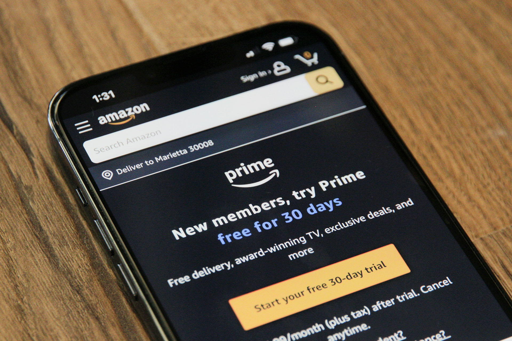

Welcome to our comprehensive review of Amazon Prime! Are you considering subscribing to this popular service but wondering if it’s worth the cost? Look no further as we dive into the perks and benefits that come with an Amazon Prime membership.

With Amazon Prime, you not only get fast shipping on millions of items, but you also gain access to a wide range of exclusive deals and entertainment options. From Prime Video, where you can stream your favorite movies and TV shows, to Prime Music, which lets you groove to millions of songs, Amazon Prime offers a plethora of content to keep you entertained.

But it doesn’t end there. As an Amazon Prime member, you also enjoy additional benefits like early access to new product launches, exclusive events, and more. So, let’s take a closer look at all the reasons why Amazon Prime might be the perfect subscription for you.

## Amazon Prime Membership: What You Need to Know

Welcome to the world of Amazon Prime membership! When you sign up for a membership, you gain access to a plethora of exciting features and benefits that make your online shopping and entertainment experience truly exceptional.

### The Key Features of Amazon Prime

- **Prime Video:** Dive into a vast library of movies, TV shows, and original content across various genres. With Prime Video, you can stream your favorite shows and movies anytime, anywhere.
- **Prime Music:** Immerse yourself in millions of songs and discover new music with Prime Music. Enjoy ad-free streaming and create personalized playlists to suit your mood.
- **Fast Shipping:** Say goodbye to long delivery waits. With Amazon Prime, you’ll enjoy fast and reliable shipping on millions of eligible items, getting your orders delivered to your doorstep in no time.

### The Benefits of Amazon Prime Membership

- **Exclusive Deals:** As an Amazon Prime member, you’ll have early access to exclusive deals and discounts that are not available to regular customers. Save big on a wide range of products and enjoy special promotions throughout the year.

- **Prime Reading:** Access an extensive library of e-books, magazines, and comics with Prime Reading. Choose from a variety of genres and indulge in captivating stories, inspiring articles, and informative publications.

- **Prime Gaming:** Gamers rejoice! With Prime Gaming, you’ll get free games, exclusive in-game content, and a Twitch.tv subscription every month. Enhance your gaming experience and discover new titles with this exciting benefit.

- **Prime Photos:** Store an unlimited number of photos securely in the cloud with Prime Photos. Safeguard your precious memories and access them from any device, anywhere.

> Being an Amazon Prime member means more than just shopping. It’s about enjoying a comprehensive range of features and benefits that enhance your lifestyle and entertainment choices.

So, whether you’re binge-watching your favorite shows on Prime Video, grooving to your favorite tunes with Prime Music, or getting your orders delivered faster with fast shipping, an Amazon Prime membership offers endless possibilities.

[Sign up for Amazon Prime](https://amzn.to/3w93KIf)

## Amazon Prime Shipping: Faster Deliveries at Your Doorstep

When it comes to fast shipping, Amazon Prime is in a league of its own. With its efficient delivery system, Amazon Prime ensures that packages reach your doorstep in record time. Whether you need a last-minute gift or everyday essentials, the expedited shipping provided by Amazon Prime will have you covered.

One of the key benefits of Amazon Prime shipping is the reduced delivery times. As a member, you can expect your orders to arrive within a matter of days, sometimes even within 24 to 48 hours. This means that you no longer have to wait eagerly for your purchases to arrive. Instead, you can enjoy the convenience of swift and reliable delivery right to your door.

The fast shipping service offered by Amazon Prime is perfect for those who value efficiency and want their items delivered promptly. Whether it’s a new book, electronics, or even groceries, Amazon Prime ensures that you receive your orders quickly, allowing you to enjoy your purchases without delay.

But it doesn’t stop there. Amazon Prime shipping also provides a seamless experience by allowing you to track your packages in real-time. With just a few clicks, you can stay updated on the whereabouts of your order, ensuring peace of mind throughout the shipping process.

Amazon Prime understands that time is of the essence, and that’s why they have prioritized fast shipping and efficient delivery times. So, if you’re looking for a subscription service that offers the convenience of rapid delivery, look no further than Amazon Prime.

- Reduced delivery times for a hassle-free experience.
- Swift delivery within 24 to 48 hours.
- Real-time package tracking for peace of mind.
- Effortless convenience for all your shopping needs.

With Amazon Prime shipping, you can say goodbye to long waits and hello to fast, reliable delivery right at your doorstep. So why wait? Start enjoying the benefits of Amazon Prime today and experience the convenience of faster deliveries.

[Sign up for Amazon Prime](https://amzn.to/3w93KIf)

## Amazon Prime Video: Your Gateway to Entertainment

When it comes to streaming services, Amazon Prime Video stands out as a top choice for entertainment. With its extensive library of movies and TV shows, it offers a wide range of options to keep you entertained for hours on end.

One of the biggest advantages of Amazon Prime Video is the exclusive content it provides. From award-winning original series to highly anticipated movies, there is always something new and exciting to watch. Whether you’re a fan of gripping dramas, hilarious comedies, or thrilling action films, Amazon Prime Video has you covered.

> Amazon Prime Video has quickly become one of our favorite streaming platforms. The selection of TV shows and movies is impressive, and we love their original content.

Another great feature of Amazon Prime Video is its user-friendly interface. The platform is designed to make streaming easy and enjoyable. With intuitive navigation and personalized recommendations, you can quickly find the content that suits your interests.

Whether you’re in the mood for a binge-watching session of your favorite TV show or a movie night with friends, Amazon Prime Video has the content you need. With its vast collection of titles and user-friendly interface, it truly is your gateway to entertainment.

[Sign up for Amazon Prime](https://amzn.to/3w93KIf)

## Amazon Prime Music: Groove to Your Favorite Tunes

When it comes to music streaming services, Amazon Prime Music has established itself as a frontrunner in the industry. With a vast music library and a seamless streaming experience, it offers a wide range of options for music lovers.

### Explore a Diverse Music Library

Amazon Prime Music boasts a comprehensive music library that caters to all genres and tastes. From the latest hits to timeless classics, you’re sure to find your favorite tunes and discover new artists along the way. Whether you’re into pop, rock, hip-hop, country, or any other genre, Amazon Prime Music has you covered.

### Ad-Free Streaming for an Uninterrupted Experience

One of the standout features of Amazon Prime Music is its ad-free streaming. Say goodbye to annoying interruptions and enjoy a seamless listening experience. There’s nothing quite like immersing yourself in your favorite tracks without any distractions.

### Curated Playlists for Every Mood and Occasion

Amazon Prime Music understands that music is more than just melodies. It’s a way to evoke emotions, set the mood, and enhance every moment. That’s why it offers curated playlists tailored to various moods, occasions, and activities. Whether you’re looking to unwind after a long day or get pumped up for a workout, you’ll find the perfect playlist to accompany you.

> Amazon Prime Music provides an impressive selection of songs and playlists, making it easy to find the perfect soundtrack for any occasion.

### Easy Accessibility Across Devices

With Amazon Prime Music, you can enjoy your favorite tunes anytime, anywhere. Whether you’re on your computer, smartphone, or tablet, the service ensures that your music is accessible across all your devices. So you’ll never have to miss a beat, no matter where you are.

### Discover New Favorites with Personalized Recommendations

Not sure what to listen to next? Amazon Prime Music has you covered with its personalized recommendations. Based on your listening habits, the service suggests new artists, albums, and songs that align with your preferences. It’s a great way to expand your musical horizons and discover hidden gems.

- Discover an extensive music library with diverse genres.
- Enjoy ad-free streaming for uninterrupted listening.
- Access curated playlists for every mood and occasion.
- Listen across devices, anytime, anywhere.
- Discover new favorites with personalized recommendations.

So whether you’re a music enthusiast or just looking for a reliable streaming service, Amazon Prime Music has something for everyone. Get ready to groove to your favorite tunes and elevate your music streaming experience with Amazon Prime.

[Sign up for Amazon Prime](https://amzn.to/3w93KIf)

## Amazon Prime Deals: Exclusive Savings for Members

As an Amazon Prime member, you gain access to a plethora of exclusive deals and discounts that can help you save money on a wide range of products. These exclusive offers are one of the many benefits of being a Prime member, making your subscription even more valuable.

Whether you’re shopping for electronics, home appliances, fashion items, or everyday essentials, Amazon Prime deals have you covered. With discounts available on popular brands such as Apple, Samsung, Nike, and more, you can find the products you love at prices that won’t break the bank.

Not only do Prime members get access to exclusive discounts, but they also get early access to Lightning Deals. These limited-time offers provide substantial discounts on a variety of products, but they are only available for a short duration or until stocks last. So, being the first to grab these deals can be a thrilling experience, giving you the chance to save big on your favorite items.

> Being an Amazon Prime member has been a game-changer for us. The exclusive deals and discounts have helped us save a significant amount of money on various purchases, from electronics to household essentials. It’s definitely worth it!

In addition to everyday discounts, Prime members also have access to Prime Day, an annual shopping extravaganza exclusive to Prime subscribers. During this event, Amazon offers massive discounts across a wide range of categories, making it the perfect time to score incredible deals and stock up on your favorite products.

To stay updated on the latest Amazon Prime deals and offers, you can explore the "Prime Exclusive Deals" section on the Amazon website or use the Amazon app. This section highlights the current deals available exclusively for Prime members, allowing you to easily find the best savings opportunities.

### Key Benefits:

- Exclusive discounts on popular brands.
- Early access to Lightning Deals.
- Prime Day deals extravaganza.

By taking advantage of these exclusive savings, Amazon Prime members can enhance their shopping experience and maximize the value of their membership. So why wait? Start enjoying the benefits of Amazon Prime deals and exclusive offers today!

[Sign up for Amazon Prime](https://amzn.to/3w93KIf)

## Amazon Prime Benefits: More Than Just Fast Shipping

As an Amazon Prime member, you gain access to a plethora of benefits, perks, and additional features that go beyond fast shipping. Let’s explore some of the ways you can make the most out of your Prime membership:

1. **Exclusive Events:** Enjoy invitations to exclusive events, such as Prime Day, where you can take advantage of incredible deals and discounts on a wide range of products.

2. **Early Access:** Be the first to get your hands on new product launches by taking advantage of Prime Early Access. Stay ahead of the curve and stay informed with the latest trends.

3. **Prime Reading:** Access a vast library of books, magazines, and comics with Prime Reading. Discover new authors, binge-read popular series, or immerse yourself in your favorite genres.

4. **Prime Gaming:** Dive into the world of gaming with Prime Gaming. Claim free games, exclusive in-game content, and enjoy monthly offerings that will satisfy your gaming cravings.

> Becoming an Amazon Prime member not only offers the convenience of fast shipping but also allows you to unlock a world of additional benefits. From exclusive events to early access to new products, Amazon Prime truly rewards its members.

With Amazon Prime, the perks don’t end at just fast shipping. Take advantage of these additional features and enjoy a more enriching experience with your membership.

[Sign up for Amazon Prime](https://amzn.to/3w93KIf)

## Amazon Prime Cost: Is It Worth the Investment?

When considering any subscription service, it’s important to evaluate the cost and determine whether it provides sufficient value for the money spent. In the case of Amazon Prime, the membership price is a key factor to consider.

Currently, the cost of an Amazon Prime membership is $119 per year or $12.99 per month. This includes access to a wide range of benefits and perks, such as free two-day shipping, Prime Video streaming, and exclusive deals. But is it worth the investment?

For frequent online shoppers who rely on fast shipping, the cost of Amazon Prime is often justified by the convenience and savings it brings. With free two-day shipping on eligible items, members can enjoy faster deliveries right to their doorstep. This not only saves time but can also lead to savings on shipping fees.

Additionally, Prime Video offers a vast library of movies and TV shows for unlimited streaming. This entertainment value alone can make the membership price worthwhile for those who enjoy binge-watching their favorite shows or discovering new content.

Other benefits, such as access to exclusive deals and discounts, add to the overall value of Amazon Prime. Prime members often enjoy early access to sales, along with special offers that can result in significant savings on a wide range of products.

> The convenience and savings we’ve experienced through Amazon Prime have made it a worthwhile investment for us. The fast shipping and access to exclusive deals have more than paid for the membership cost.

Despite the numerous benefits, it’s important to consider your individual needs and usage patterns before deciding if Amazon Prime is worth it for you. If you rarely shop online or have alternative streaming services, the value may not be as significant.

In conclusion, Amazon Prime offers a variety of perks and benefits that can make the membership cost worthwhile for many users. The combination of fast shipping, access to exclusive deals, and a wide range of entertainment options provides substantial value for the investment.

[Sign up for Amazon Prime](https://amzn.to/3w93KIf)

## Amazon Prime Free Trial: Testing the Waters

Are you curious about what Amazon Prime has to offer but unsure if it’s worth the investment? Well, you’re in luck! Amazon Prime offers a free trial period that allows potential members to test the service before committing to a full membership. This trial period gives you the opportunity to experience all the perks and benefits of being a Prime member, giving you a taste of what’s in store.

To sign up for the Amazon Prime free trial, simply visit the Amazon website and follow the prompts to create an account. Once you’ve signed up, you’ll have access to a range of benefits, including fast shipping, Prime Video, and exclusive deals.

During the trial period, you’ll have the chance to explore the wide selection of movies and TV shows available on Prime Video. Whether you’re a fan of gripping dramas, hilarious comedies, or thrilling action, there’s something for everyone. You can also take advantage of the lightning-fast shipping, with many eligible items arriving at your doorstep in just a matter of days.

> If you’re considering becoming an Amazon Prime member, the free trial is the perfect opportunity to test the waters and see if the service suits your needs.

It’s important to note that the trial period is typically 30 days, but this may vary depending on current promotions. Once the trial period is over, you will be automatically enrolled in the paid membership unless you cancel before the trial period ends.

### What to Expect During the Trial Period:

- Access to Prime Video’s extensive library of movies and TV shows.
- Fast shipping on eligible items.
- Exclusive deals and discounts for Prime members.
- An opportunity to fully experience the convenience and benefits of an Amazon Prime membership.
- The option to cancel the membership at any time during the trial period without incurring any charges.

So, if you’re on the fence about becoming an Amazon Prime member, why not give the free trial a go? It’s a risk-free way to explore the benefits and see if it’s the right fit for you. Sign up today and discover the world of Amazon Prime.

[Sign up for Amazon Prime](https://amzn.to/3w93KIf)

## Amazon Prime Alternatives: Exploring Other Options

If you’re considering a subscription service that offers similar perks and benefits as Amazon Prime, you’re in luck. There are several competing services in the market that provide a comparable experience. Let’s take a closer look at some of the top alternatives and compare their offerings.

### Walmart+

Walmart+ is a subscription service offered by the retail giant Walmart. With Walmart+, you get benefits such as fast and free delivery on eligible items, member prices on fuel, and access to mobile scan & go for convenient in-store shopping. The service also includes a range of entertainment options, including free unlimited delivery from your local store*, and even discounts on prescription medications†. While Walmart+ may not have the extensive streaming library of Amazon Prime Video, its focus on everyday essentials and in-store perks make it a compelling alternative.

### Target Circle

Target Circle is Target’s loyalty program that offers various perks and benefits. With Target Circle, you can enjoy exclusive deals, personalized offers, and earn 1% cash back on purchases to use on future Target runs. The program also provides access to special shopping events and early access to sales. While Target Circle doesn’t offer the same level of streaming and entertainment options as Amazon Prime, its rewards and discounts make it an attractive option for frequent Target shoppers.

### Costco Membership

If you’re looking for a subscription service that offers more than just online shopping perks, Costco Membership might be worth considering. With a Costco Membership, you have access to discounted prices on a wide range of products and services. Costco also offers additional benefits like discounted healthcare services, travel deals, and access to the Costco Travel portal. While Costco Membership doesn’t provide the same streaming and entertainment options as Amazon Prime, its focus on value and bulk savings make it a popular choice.

These are just a few examples of the Amazon Prime alternatives available. When comparing different services, it’s important to consider your specific needs and preferences. Take the time to evaluate the benefits, discounts, and additional features offered by each service to make an informed decision that suits your lifestyle.

Overall, the availability of these alternative subscription services provides consumers with more options to choose from based on their individual requirements. Whether you prioritize fast shipping, exclusive deals, or a combination of benefits, there is likely a service that caters to your needs.

So take a moment to explore these alternatives before making your final decision. Happy subscription hunting!

[Sign up for Amazon Prime](https://amzn.to/3w93KIf)

## Conclusion

After conducting a thorough Amazon Prime review, we have reached our final verdict. As an all-encompassing subscription service, Amazon Prime offers an impressive array of benefits and features that make it a compelling choice for consumers.

The perks of fast shipping, access to a vast content library on Prime Video, and a diverse collection of music on Prime Music provide exceptional value for members. Additionally, the exclusive deals and discounts make shopping on Amazon even more rewarding.

However, it is essential to consider the cost of a Prime membership when assessing its overall worth. While the subscription price may seem high, the multitude of benefits and added convenience justify the investment for many users. Weighing the advantages against the expense, it is clear that Amazon Prime provides an excellent subscription experience.

In conclusion, our assessment of Amazon Prime indicates that it is a highly recommended subscription service. It seamlessly combines fast shipping, entertainment, and exclusive deals, offering great value for money. Whether you are an avid shopper or a media enthusiast, Amazon Prime delivers an exceptional experience that enhances your daily life.

[Sign up for Amazon Prime](https://amzn.to/3w93KIf)

## FAQ

### Is Amazon Prime worth the subscription?

Absolutely! Amazon Prime offers a wide range of perks and benefits that make the subscription more than worth it. From fast shipping to exclusive deals and access to streaming services, Prime members get their money’s worth and more.

### What are the key features of Amazon Prime membership?

Amazon Prime membership comes with a variety of features, including fast shipping, access to Prime Video and Prime Music, exclusive deals, early access to new products, and more. It’s a comprehensive package that caters to various needs and interests.

### How does Amazon Prime shipping work?

Amazon Prime shipping offers expedited delivery times for eligible items. With Prime, you can enjoy faster deliveries right at your doorstep. This service is particularly beneficial for those who frequently shop on Amazon and want their purchases to arrive quickly.

### What is Amazon Prime Video?

Amazon Prime Video is a popular streaming service that offers a vast library of movies, TV shows, and original content. As a Prime member, you have access to exclusive shows, and you can stream your favorite content anytime, anywhere, on various devices.

### What is Amazon Prime Music?

Amazon Prime Music is a music streaming service included with your Prime membership. With a vast music library, including ad-free streaming and personalized playlists, you can groove to your favorite tunes without interruptions.

### Are there any exclusive deals for Amazon Prime members?

Yes, Amazon Prime offers exclusive deals and discounts for its members. From limited-time offers to early access to Lightning Deals, Prime members have access to a wide range of savings on various products.

### What additional benefits does Amazon Prime offer?

In addition to fast shipping and exclusive deals, Amazon Prime members enjoy additional benefits such as access to exclusive events, Prime Wardrobe for trying on clothes before buying, and early access to new product launches.

### How much does Amazon Prime cost?

The cost of an Amazon Prime membership is $119 per year or $12.99 per month. For the value it provides, including fast shipping, streaming services, and exclusive deals, many find it to be a worthwhile investment.

### Can I try Amazon Prime before committing to a full membership?

Yes, Amazon offers a free trial of Amazon Prime for new members. This trial period allows you to test out the service and its features before deciding to commit to a full membership.

### Are there any alternatives to Amazon Prime?

Yes, there are alternative subscription services in the market that offer similar perks and benefits. Some popular alternatives include Walmart+, Target Circle, and Costco memberships. It’s worth exploring these options and comparing them to Amazon Prime to find the best fit for your needs.

[Sign up for Amazon Prime](https://amzn.to/3w93KIf)